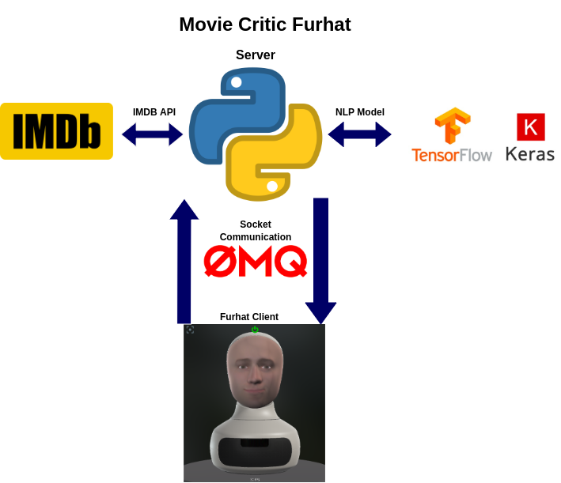
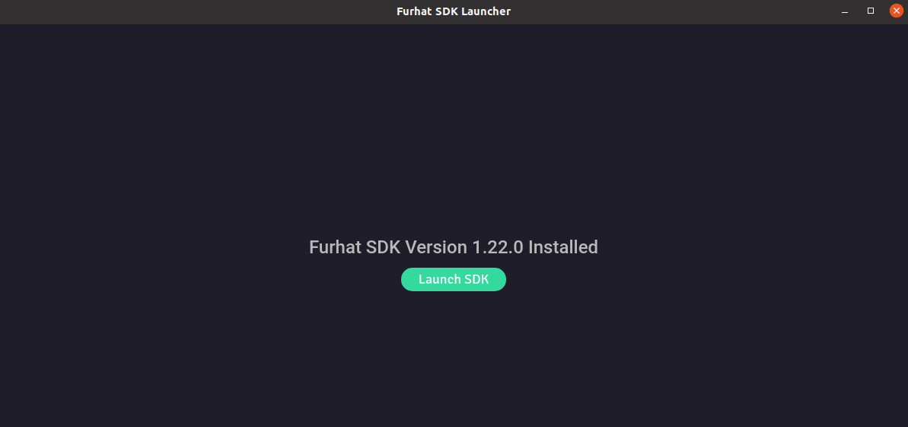
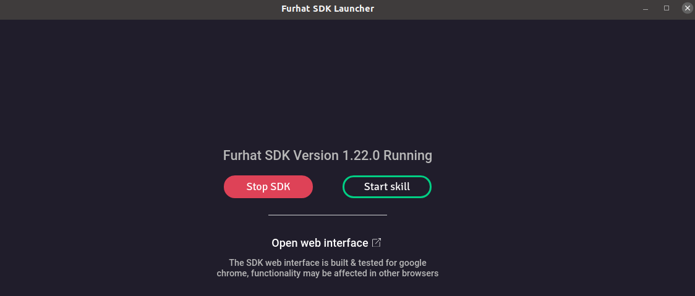

# Furhat Movie Critic Skill Arquitecture

This repository is a simple conversational robot application using Furhat. Furhat interacts with a remote server on a 2-way communication pipeline. 

A state machine has been implemented with a few nodes. On each node, Furhat interacts with the user and the server is requested to listen to the users's utterances. In some nodes, the server proceeds with sentiment analysis, throuhgh an NLP arquitecture (bi-directional LSTM) trained on an IMDB database. The NLP arquitecture uses keras with a tensorflow 2.0 backend, the server has GPU compatibality by default. The user utterances are encoded and passed through the model. On other nodes, Furhat's movie critic knowledge of the requested movie is gathered from IMDB reviews acquired on the server side through an API, and sent to Furhat to communicate with the user. The project was inspired from a FurhatRobotics [repository](
https://github.com/FurhatRobotics/camerafeed-demo). 



---------------

##  State Machine description

Interaction Loop:
1) (Initial State) ----> Asks for a movie and stores it.

2) (Review State) ----> Asks for the user review of the chosen movie.

3) (Sentiment Analysis State) ----> Processes the sentiment of the user, estimating whether the review was positive or negative (through the NLP assignment).

4) (Furhat Review State) ----> Furhat asks if the user wants to hear Furhat’s opinion, and, if so, outputs a review from IMDb.

5) (Terminal/ReStart State) ----> Furhat prompts the user if they want to stop discussing or start to talk about another movie (It connects again to the Initial State).

----------
# Instalation

##  Ubuntu 20.04/18.04  (tested)

### Requirements:
- Anaconda 3
- Furhat SDK
- Java 8.0 JDK (recommended)

##  Instructions 

0) Open a terminal
1) Clone the repository 
```
cd ~
git clone https://github.com/DanielLSM/imdb-furhat
```
2) Move to the repository in your system
```
cd imdb-furhat
```
3) Install the anaconda environment
```
conda env create -f furhat.yml
```
4) Load the anaconda environment
```
conda activate furhat
```
5) Alter the launch.json
```
"Furhat_IP": "<local ip of the robot>",
"Dev_IP": "<local ip of your computer>", //You might be able to use ifconfig -a or ipconfig /all
```
6) Build the Movie Critic skill.
```
cd imdb-furhat/MovieCritic
sudo ./gradlew shadowJar
```

6) Obtain parameters for the NLP network
- Download the [model paramters](https://kth.box.com/s/px6h4m0g122czotztumx93u8rqe5h0od) folder and uncompress it. Then, put the file ```weights.08.hdf5``` inside this repository (just next to this README.md). You have more 2 more parameter files to try for curiosity.


## Running the arquitecture
The server should be turned on, before Furhat (run the server script before lauching the skill on Furhat's SDK).

# Server side 
1) Move to the "detection-server" repository in your system
```
cd imdb-furhat/detection-server
```
2) Run the program :)
```
python server.py
```

# Furhat side

1) Launch Furhat's SDK

2) Load the skill placed on ```imdb-furhat/MovieCritic/build/libs/MovieCritic-all.skill```
